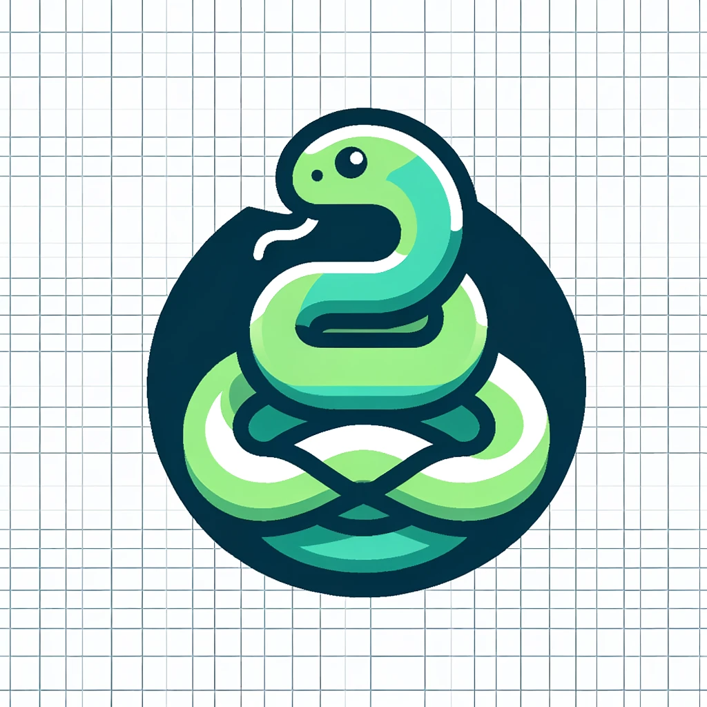

<a name="readme-top"></a>

<!-- PROJECT LOGO -->
<br />
<div align="center">
  <a href="https://github.com/ruudjuffermans/Python-Playground">
    
  </a>

  <h3 align="center">Python Playground</h3>

  <p align="center">
Welcome to Python Playground! This repository is a personal journey through the fascinating world of Python, showcasing learnings, experiments, and insights into Python's documentation, the standard library, and various external libraries. Whether you're a beginner eager to explore Python's capabilities or an experienced developer looking for new tricks and tools, this repository is designed to offer something valuable for everyone.
    <br />
    <a href="https://github.com/ruudjuffermans/Python-Playground"><strong>Explore the docs »</strong></a>
    <br />
    <br />
    <a href="https://github.com/ruudjuffermans/Python-Playground">View Demo</a>
    ·
    <a href="https://github.com/ruudjuffermans/Python-Playground/issues">Report Bug</a>
    ·
    <a href="https://github.com/ruudjuffermans/Python-Playground/issues">Request Feature</a>
  </p>
</div>

## Contents

- [Collections Module](#collections-module)

## About The Project

There are many great README templates available on GitHub; however, I didn't find one that really suited my needs so I created this enhanced one. I want to create a README template so amazing that it'll be the last one you ever need -- I think this is it.

Here's why:

- Your time should be focused on creating something amazing. A project that solves a problem and helps others
- You shouldn't be doing the same tasks over and over like creating a README from scratch
- You should implement DRY principles to the rest of your life :smile:

Of course, no one template will serve all projects since your needs may be different. So I'll be adding more in the near future. You may also suggest changes by forking this repo and creating a pull request or opening an issue. Thanks to all the people have contributed to expanding this template!

Use the `BLANK_README.md` to get started.

<p align="right">(<a href="#readme-top">back to top</a>)</p>

## Getting Started

<p align="justify">These instructions will get you a copy of the project up and running on your local machine for development and testing purposes. See deployment for notes on how to deploy the project on a live system.</p>

### Prerequisites

You need Python 3.x to run the following code. You can have multiple Python versions (2.x and 3.x) installed on the same system without problems.
In Ubuntu, Mint and Debian you can install Python 3 like this:

```sh
sudo apt-get install python3 python3-pip
```

### Installation

Below is an example of how you can instruct your audience on installing and setting up your app. This template doesn't rely on any external dependencies or services.

1. Clone the repo

```sh
git clone https://github.com/ruudjuffermans/Python-Playground.git
```

2. Setup the virtual environment

```sh
python3 -m venv .env
```

3. Activate the virtual environment

```sh
source ./.env/bin/activate
```

4. Upgrade pip

```sh
python3 -m pip install --upgrade pip
```

5. Install the dependencies

```sh
pip install --no-cache-dir -r requirements.txt
```

<p align="right">(<a href="#readme-top">back to top</a>)</p>

## Usage

<p align="right">(<a href="#readme-top">back to top</a>)</p>

## Roadmap

- [x] CollectionsModule
- [x] Requests
- [ ] Add Additional Templates w/ Examples
- [ ] Add "components" document to easily copy & paste sections of the readme
- [ ] Multi-language Support
  - [ ] Chinese
  - [ ] Spanish

See the [open issues](https://github.com/othneildrew/Best-README-Template/issues) for a full list of proposed features (and known issues).

<p align="right">(<a href="#readme-top">back to top</a>)</p>

## Contributing

Contributions are what make the open source community such an amazing place to learn, inspire, and create. Any contributions you make are **greatly appreciated**.

If you have a suggestion that would make this better, please fork the repo and create a pull request. You can also simply open an issue with the tag "enhancement".
Don't forget to give the project a star! Thanks again!

1. Fork the Project
2. Create your Feature Branch (`git checkout -b feature/AmazingFeature`)
3. Commit your Changes (`git commit -m 'Add some AmazingFeature'`)
4. Push to the Branch (`git push origin feature/AmazingFeature`)
5. Open a Pull Request

<p align="right">(<a href="#readme-top">back to top</a>)</p>

## License

Distributed under the Apache License. See `LICENSE` for more information.

<p align="right">(<a href="#readme-top">back to top</a>)</p>

## Contact

RuudJuffermans - [@your_twitter](https://twitter.com/your_username) - ruudjuf@gmail.com

Project Link: [https://github.com/your_username/repo_name](https://github.com/your_username/repo_name)

<p align="right">(<a href="#readme-top">back to top</a>)</p>

<!-- MARKDOWN LINKS & IMAGES -->
<!-- https://www.markdownguide.org/basic-syntax/#reference-style-links -->

[contributors-shield]: https://img.shields.io/github/contributors/othneildrew/Best-README-Template.svg?style=for-the-badge
[contributors-url]: https://github.com/othneildrew/Best-README-Template/graphs/contributors
[forks-shield]: https://img.shields.io/github/forks/othneildrew/Best-README-Template.svg?style=for-the-badge
[forks-url]: https://github.com/othneildrew/Best-README-Template/network/members
[stars-shield]: https://img.shields.io/github/stars/othneildrew/Best-README-Template.svg?style=for-the-badge
[stars-url]: https://github.com/othneildrew/Best-README-Template/stargazers
[issues-shield]: https://img.shields.io/github/issues/othneildrew/Best-README-Template.svg?style=for-the-badge
[issues-url]: https://github.com/othneildrew/Best-README-Template/issues
[license-shield]: https://img.shields.io/github/license/othneildrew/Best-README-Template.svg?style=for-the-badge
[license-url]: https://github.com/othneildrew/Best-README-Template/blob/master/LICENSE.txt
[linkedin-shield]: https://img.shields.io/badge/-LinkedIn-black.svg?style=for-the-badge&logo=linkedin&colorB=555
[linkedin-url]: https://linkedin.com/in/othneildrew
[product-screenshot]: images/screenshot.png
[Next.js]: https://img.shields.io/badge/next.js-000000?style=for-the-badge&logo=nextdotjs&logoColor=white
[Next-url]: https://nextjs.org/
[React.js]: https://img.shields.io/badge/React-20232A?style=for-the-badge&logo=react&logoColor=61DAFB
[React-url]: https://reactjs.org/
[Vue.js]: https://img.shields.io/badge/Vue.js-35495E?style=for-the-badge&logo=vuedotjs&logoColor=4FC08D
[Vue-url]: https://vuejs.org/
[Angular.io]: https://img.shields.io/badge/Angular-DD0031?style=for-the-badge&logo=angular&logoColor=white
[Angular-url]: https://angular.io/
[Svelte.dev]: https://img.shields.io/badge/Svelte-4A4A55?style=for-the-badge&logo=svelte&logoColor=FF3E00
[Svelte-url]: https://svelte.dev/
[Laravel.com]: https://img.shields.io/badge/Laravel-FF2D20?style=for-the-badge&logo=laravel&logoColor=white
[Laravel-url]: https://laravel.com
[Bootstrap.com]: https://img.shields.io/badge/Bootstrap-563D7C?style=for-the-badge&logo=bootstrap&logoColor=white
[Bootstrap-url]: https://getbootstrap.com
[JQuery.com]: https://img.shields.io/badge/jQuery-0769AD?style=for-the-badge&logo=jquery&logoColor=white
[JQuery-url]: https://jquery.com
